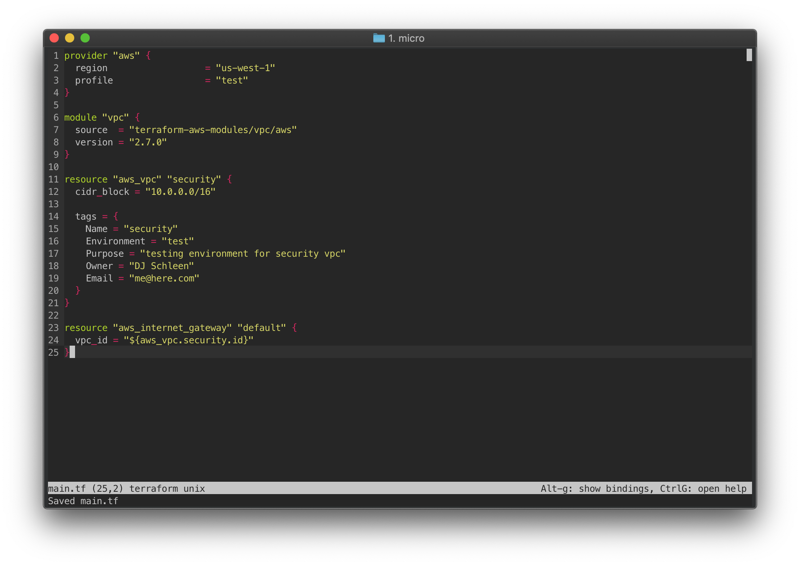

# Terraform Syntax Highligher for Micro

## Overview

If you are using `micro` as a text editor (Available [here](https://micro-editor.github.io/)) and developing with [Terraform](https://www.terraform.io/) you can use this to highlight `.tf` files in the editor.

## Installation

A quick and dirty installation script is available to copy the `terraform.micro` file into your `~/.config/micro/syntax` folder as `terraform.yaml`.

## Contributing

Feel free to apply any fixes or modifications and create a pull request for me to merge into the master code base.
